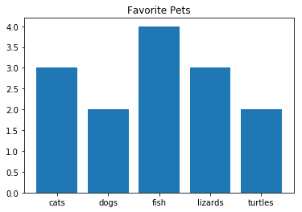

# Advanced Python 

## Pandas

*Pandas is a python tool to analyze data. We load a CSV file into a dataframe*

***

To use

`import pandas as pd`
`data = pd.read_csv("file.csv")`

Some useful things to do

- `data.head()` display the first lines of the dataframe
- `data.count()` how many items are in the dataframe
- `data.nunique()` how many unique items are in a dataframe
- `data.unique()` the actual unique values seen in a dataframe 
- `data.value_counts()` the frequency of the unique values found
- `data.groupby()` collects data based on repeating values seen in a column
- `data.sort_values( by = "column name" ascending=True)` sorts dataframe based on a column called "column name"
- `data.mean()` arithmetic mean of dataframe values
- `data.max()` highest value seen in a dataframe
- `data.min()` lowest value seen in a dataframe
- `data.tolist()` makes a Python list out of a portion of dataframe, useful for graphing
- `data.loc["search"]` will locate all items in dataframe that match "search"
- `data.index` shows you index details of the dataframe
- `data.index.tolist()` converts the index into a list

## Matplotlib

*Is a tool to draw graphs*

To use

`import matplotlib.pyplot as plt`

Everything you put into a graph object needs to be a list
Example Bargraph:
`plt.bar(["dogs","cats","fish","lizards","turtles"],[2,3,4,3,2])`
`plt.title("Favorite Pets")`
`plt.show()`

